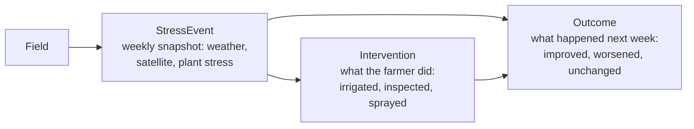
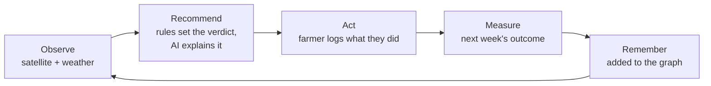

# Daiisi

An adaptive intelligence system that gives smallholder farmers satellite-grade advice about their own fields, in plain words, from nothing more than a web browser and a phone number.

Smallholder farms are 84% of the world's farms, yet almost all agricultural technology is built for large industrial farms. Climate change makes their conditions harder to predict every year. DAIISI watches each field from space, keeps a **personal memory graph** of what happened on that farm, and uses it to say what to do this week and why.

## The idea: a personal memory graph

Every week DAIISI records a snapshot of each field. Those records are connected as a graph, not stored as a spreadsheet of unrelated rows:



- **Field:** one plot, saved per phone number.
- **StressEvent:** the field's weekly snapshot (rainfall against crop water use, greenness trend, heat, satellite freshness, seasonal outlook), plus an embedding of it.
- **Intervention:** an action the farmer logged, by voice.
- **Outcome:** the following week, the change in greenness is measured and recorded against that event and its intervention.

The graph is stored as linked Postgres tables (`fields`, `stress_events`, `interventions`, `outcomes`, with foreign keys between them and pgvector embeddings).

### Graph retrieval, so the AI sees the right history

To write a new recommendation we do not hand the model a farm's whole history. We retrieve a small set of past weeks from **that same field** with **submodular maximization** (a greedy facility-location objective over the embeddings, in `lib/retrieval.ts`). It picks past situations that are both relevant and different from each other, so the model sees a useful spread instead of ten near-identical "hot and dry" weeks, together with what happened afterwards. That grounds advice in the farmer's own history and lets it change with observed outcomes.

## How a week works



1. **Sign in** with just a phone number. No email or password.
2. **Add a field.** Find your location or pan the map, draw the plot boundary, then say what is planted, when, and the soil. Saved fields appear in the list on the right.
3. **Observe.** Three real data sources feed the results:
   - **Sentinel-2** (Copernicus Data Space): light beyond what the eye sees. From it we compute **NDVI**, the Normalized Difference Vegetation Index, a plant-health signal that can show dehydration before wilting is visible. We show it as a **weekly NDVI chart** over the last 90 days, and as true-colour and greenness images.
   - **Open-Meteo:** rainfall, evapotranspiration (the water the crop uses), heat, a 5-year rain normal and a **16-day forecast**. The forecast is what tells us whether rain is coming before the crop is in trouble.
   - **ECMWF SEAS5**, through Open-Meteo's seasonal API: whether the coming months look wetter, drier or hotter than normal.
4. **Recommend.** `lib/stressEvent.ts` combines these into a verdict of OK, Watch or Act. The AI (Groq, `openai/gpt-oss-20b`) then writes a specific recommendation from the current state, the crop and planting date, the farmer's recent notes and the retrieved past weeks, for example: *"WATCH — keep an eye on the crop. Rainfall is only 42% of water lost, but 65.7 mm of rain is forecast for the next 16 days. NDVI is stable at 0.292."* The model never decides the verdict, and `lib/ai/grounding.ts` rejects any answer that quotes a number that was not in the data, contradicts the verdict, invents a cause for a past week, or misdates a note. It retries once, then falls back to plain text built from the data.
5. **Act and log.** The farmer speaks what they did and it is transcribed by Deepgram, interpreted, reviewed, and saved. An action note is linked to that week as an **Intervention**, and the AI take updates straight away.
6. **Measure and remember.** The weekly job records the outcome, and the loop continues.

## Accessibility

Many farmers do not share one language or are not comfortable with dense text, especially in the field.

- **Icons and short labels** instead of paragraphs where possible, in system web-safe fonts.
- **Translation.** The interface can be shown in other languages, with hand-written wording where machine translation reads badly.
- **Read aloud.** Recommendations can be played as speech (Deepgram Aura), so literacy is not a barrier.
- **Speak instead of type.** Notes and actions are recorded by voice (Deepgram Nova-3) straight into the farm's memory.

## What is next: SMS

Using the app needs internet today. The plan is that a farmer needs it only once, to register, and everything after that happens by text: a weekly recommendation arrives as a message and a reply logs what they did. The backend for this exists: `lib/smsDigest.ts` composes the digest, and a reply route feeds the same note pipeline that voice notes use. What is not done is connecting an SMS provider, because sending real texts needs billing set up, so **nothing is sent yet**.

## Tech stack

| | |
|---|---|
| App | Next.js 16 (App Router), React 19, TypeScript, Tailwind CSS |
| Map and charts | Leaflet with Geoman, Recharts |
| Satellite | Copernicus Data Space / Sentinel Hub (Sentinel-2 L2A) |
| Weather and climate | Open-Meteo (forecast, archive, ECMWF SEAS5 seasonal) |
| Voice | Deepgram Nova-3 (speech to text) and Aura (text to speech) |
| AI | Groq for note interpretation and recommendations; MiniLM embeddings run locally |
| Memory graph | Postgres on Neon with pgvector |
| Translation | Google Cloud Translation |

## Run it locally

```bash
npm install
cp .env.example .env.local   # then fill in the values; never commit real keys
npm run dev                  # http://localhost:3000
```

Database migrations are the numbered files in `db/migrations/`. Apply them in order to your Postgres database (use the direct, unpooled connection string for that). `npm run dev` uses `scripts/dev.mjs`, which ignores stale satellite credentials left in your shell.

Environment variables (see `.env.example`): `DATABASE_URL`, `DATABASE_URL_UNPOOLED`, `CDSE_CLIENT_ID`, `CDSE_CLIENT_SECRET`, `DEEPGRAM_API_KEY`, `GROQ_API_KEY`, `GOOGLE_API_KEY` (translation) and `CRON_SECRET` (the weekly job).

```bash
npm test        # unit tests, no network or database needed
npm run build   # production build
```

Open the app with `?asOf=2023-09-05` to replay fields as they were on a past date, using real satellite and weather data from then.


